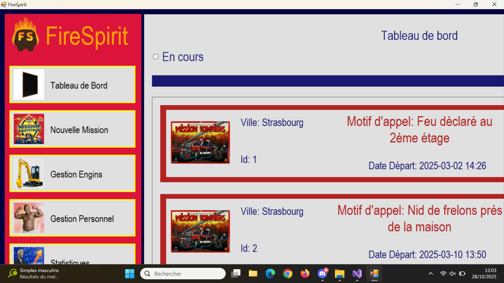
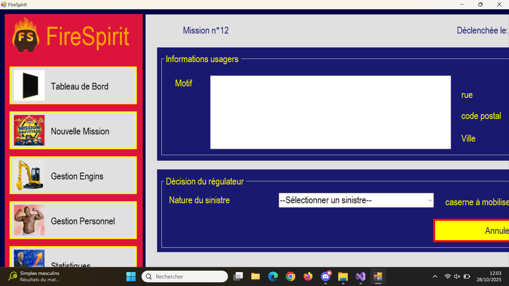
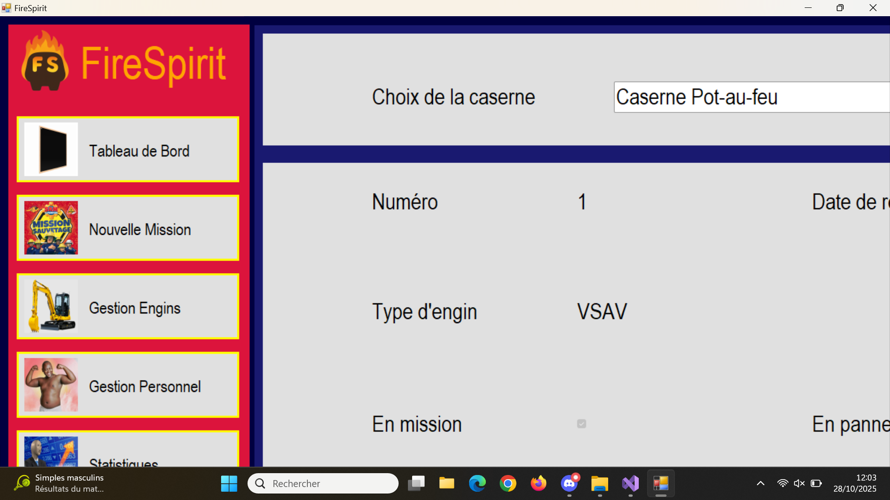
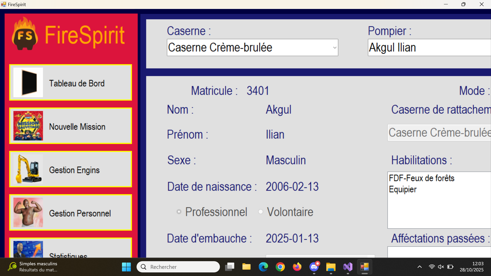

# Application pompier

On souhaite développer une application de **gestion pour les pompiers**.

- Membres du goupe : [Jean GIESE](https://git.unistra.fr/jgiese), [Hugo LEGER](https://git.unistra.fr/legerh), [Théo LUTHIN](https://git.unistra.fr/tluthin)

## Installation / lancement du jeu

Ouvrez un terminal et mettez-vous dans un répertoire où vous placerez le projet

### Mise en place du dépôt Git

1. Installer git sur votre ordinateur personnel (rien à faire si vous avez déjà Git) :
```sh
sudo apt install git
```

2. Configurer vos informations d'utilisateur :
```sh
git config --global user.name "[Prenom] [Nom]"
git config --global user.email "[email]"
```

3. Cloner ce dépôt sur votre ordinateur personnel :
```sh
git clone https://github.com/Jean-GIESE/Application-pompier.git
```
Nous avons utilisé la version Winforms C# avec Visual Studio. Si vous n'avez pas WinForms sur votre ordinateur, installez-le via le [site web](https://help.syncfusion.com/windowsforms/visual-studio-integration/download-and-installation) (l'application a été fait sur Visual Studio 2022). 

⚠️Attention​ ! Le projet ne fonctionne que sur Windows étant donné que l'interface graphique utilisée est WinForms.

### Lancement de l'application

Allez dans le répertoire `FORMULAIRE/FireSpirit` et lancez FireSpirit.sln (double-cliquez dessus) avec WinForms.

Pour le lancer, cliquez sur le bouton `▶️​ Démarrer`.

## Description

Le projet n'ayant pas été partagé via git, aucun commit n'est présent.

L'objectif est de créer une application permettant aux pompiers de gérer facilement et fluidement différentes choses comme :
- **la gestion de leurs pomiers:** qui est en mission, qui est disponible, si il y a un nouveau pompier qui n'est pas encore mis à jour dans la base de données, avoir un moyen de le mettre facilement
- **la gestion des engins:** quels véhicules sont prêts pour démarrer une missions, lequels faut-ils réparer,
- **la gestion des missions:** quelles missions sont en cours, lesquelles sont terminées, comment créer une nouvelle mission.

Pour ce faire, nous avons créer un "formulaire" principal qui fait appel et gère plusieurs "UserContol".
Ce dernier fait également appel à une base de données qui contient les informations sur les pompiers, véhicules, etc. qui se fait transmettre et gérer par les UserControl.

Le volet statistique n'est pas fonctionnel mais nous avons mis le répertoire dans "Volet statistique" pour que vous puissiez voir le code qui y est fourni. 
Ce dernier devait permettre de voir différentes statistiques ainsi que de générer un pdf récapitulatif pour les missions.

Le nom de notre application est FireSpirit.

## Captures d'écran

#### Tableau de bord :


#### Création d'une nouvelle mission :


#### Gestion des engins :


#### Gestion du personnel :



